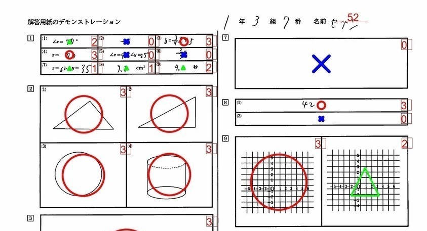
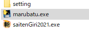

# 採点斬り2021の拡張機能：○×△をつける

  * [アロハさんのこちらの記事](https://al31ufa4.hatenablog.com/)で、採点斬り2021の出力画像に○×をつけるコードを紹介されていました。とっても素晴らしい機能だったので、採点斬り2021の拡張機能として公開することにしました。
  * 99％こちらの記事を参考に、少しだけGUIを追加し、出力画像に○×△をつけるためのソフトを作成しました。
  * 現状で、できることとできないことがあります。使用前に、このページを最後までご覧ください。

## 使い方
* [リリースのページ](https://github.com/phys-ken/saitenGiri2021-marubatu/releases)から最新版をダウンロードします。ソフト名は**marubatu.exe**です。
* まずは、[採点斬り2021](https://phys-ken.github.io/saitenGiri2021/)を使って、採点と、採点済み画像の出力を行います。
  * **setting**というフォルダ内に、**kaitoYousi**というフォルダが生成され、その中に点数配分が書かれた画像が入っている状態になっていれば、このソフトを使う準備はOKです。
* **marubatu.exe**を、saitenGiri2021.exeと同じ場所に配置します。(参考画像)

* ダブルクリックすると、処理が始まります。
* 処理が完了するとダイアログボックスが表示されます。正常に処理が終了すれば、kaitoYousiフォルダ内に、**marubatuフォルダ**が生成され、その中に○×がついた画像が保存されています。

## ご使用になる前に
  * アロハさまのコードに強く依存していますが、このソフトを使って生じたいかなる不具合について、アロハさまも私も責任を追うことはできません。
  * ご意見、ご感想は[Twitter](https://twitter.com/phys_ken)のコメントやDMでお願いします。あくまで趣味の域をでない範囲でのみ対応することをご容赦ください。
  * 現状では、全員が△の問いについても、マルの記号をつけてしまいます。以下の解決策が考えられます。
    * 事前に模範解答の採点をして、満点の登録をする。
    * outputフォルダの該当の設問のフォルダ(QQ0001)のなかに、正答の場合の場合の配点のフォルダを作る
      * 3点満点の問いであれば、半角数字で **3** という名前のフォルダを作成する。
[TOPへ戻る](https://phys-ken.github.io/phys-ken/sub2_softwares/)  
[Twitterへ](https://twitter.com/phys_ken)
